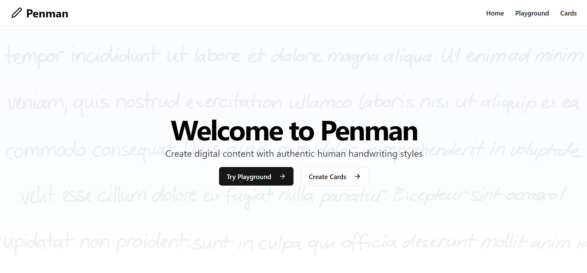

# Penman

"Penman" – A handwriting generator app that brings a personalized, authentic touch to digital content in various forms. The app provides a playground to experiment with handwriting effects and customize digital content. Users can create personalized cards from templates and export them in various formats.

---

### Playground:
The Playground allows users to experiment with handwriting effects and customize their digital content.

<video src="./public/assets/demo.mp4" autoplay muted loop></video>

#### Features
- Stream (Handwriting Effect) and Stop
- Export (PDF, PNG, PNG trans back, SVG)
- Customize attributes

#### Use Cases
- Social media text overlay
- Digital signatures

---

### Cards:
The Cards section provides a UI to create personalized cards from templates.

#### Features
- Templates library (Notes, Cards)
- Custom background (Templates)
- Multi-page docs
- Upload templates

#### Use Cases
- Thank you notes, cards
- Personalized content creation
