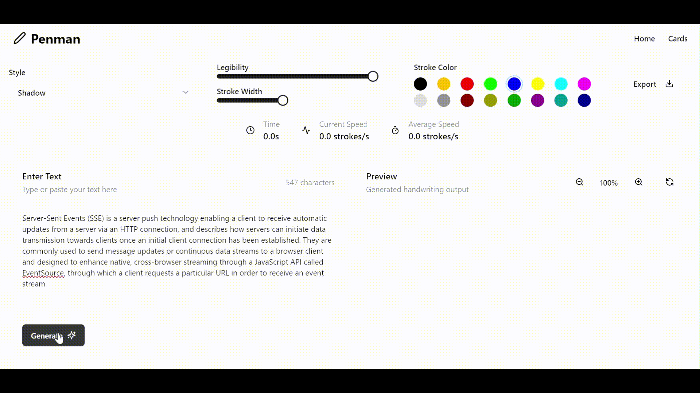
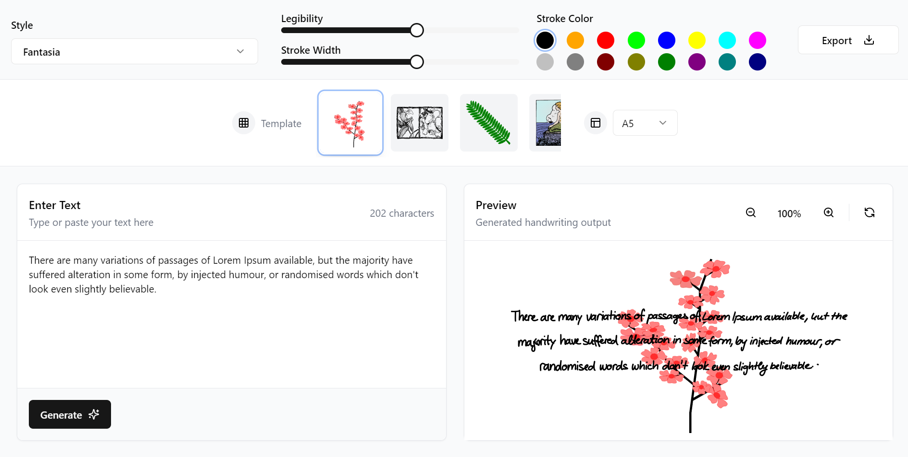

# **Penman**


**Penman** is a handwriting generator app that brings a personalized, authentic touch to digital content. It allows users to experiment with handwriting effects, create personalized cards from templates, and export their creations in various formats. Uses a custom Server-Sent Events (SSE) implementation. The SSE stream allows real-time handwriting generation by sending incremental updates to the frontend. This enables a fluid, interactive user experience as the handwriting is rendered.

---

## **Features**
### **Playground**
The Playground lets users experiment with handwriting effects and customize their digital content.



#### **Key Features**
- **Stream**: Add handwriting effects dynamically using custom SSE.
- **Refresh**: Pause and refresh the handwriting effect.
- **Export**: Save your creations in multiple formats:
  - PDF
  - PNG
  - Transparent PNG
  - SVG
- **Customization**: Adjust various attributes for a personalized look.

#### **Use Cases**
- Text overlays for social media.
- Creating digital signatures.

---

### **Cards**
The Cards section provides tools for creating personalized cards from pre-designed templates.



#### **Key Features**
- Template Library: Access pre-built templates for notes and cards.
- Custom Handwriting: Customize handwriting with available options.
- Custom Attributes: Customize color, width and background.

#### **Use Cases**
- Creating thank-you notes and cards.
- Designing personalized content for special occasions.

---

## **Running the App Using Docker Compose**

### **Prerequisites**
- [Docker](https://docs.docker.com/get-docker/) installed on your machine.
- [Docker Compose](https://docs.docker.com/compose/install/) installed (often bundled with Docker Desktop).

### **Steps to Run the App**
1. **Clone the Repository**:
   ```bash
   git clone https://github.com/parthsolanke/Penman.git
   cd Penman
   ```

2. **Set Up Environment Files**:
   Ensure `.env` files are present in the `./backend` and `./frontend` directories. Populate them with the necessary variables.

3. **Build and Run Containers**:
   ```bash
   docker-compose up --build
   ```

4. **Access the Application**:
   - **Frontend**: Open your browser and navigate to `http://localhost:3000`.
   - **Backend**: The backend API will be available at `http://localhost:8000`.

5. **Stop the Application**:
   To stop the application, press `Ctrl+C` in the terminal where the app is running or use:
   ```bash
   docker-compose down
   ```

---

## **API Documentation**
Detailed documentation for the Penman API is available [here](./public/API.md).

---

## **License**
[MIT License](./LICENSE) © 2024 Penman
